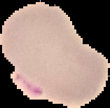
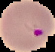
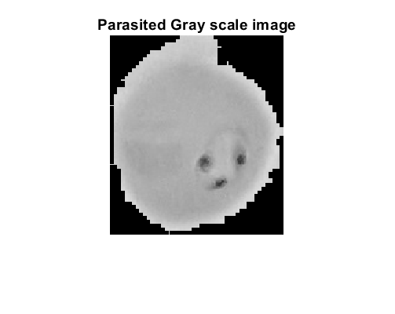
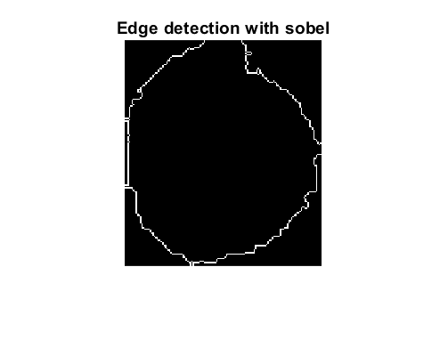
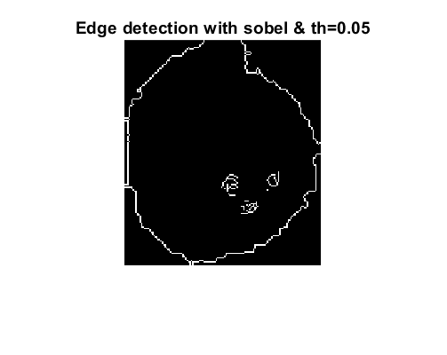
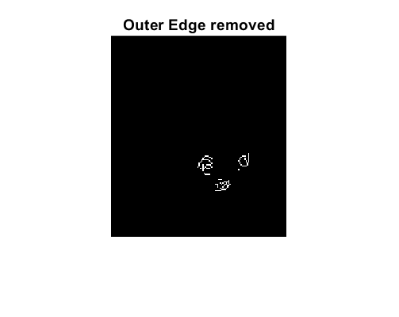
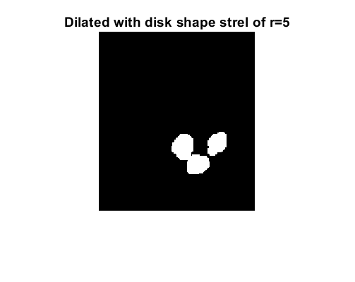

# **Malaria-Image-Classification**
For  MATLAB Central File Exchange please visit [](https://in.mathworks.com/matlabcentral/fileexchange/102114-malaria-image-classification)

For GitHub Repo please visit [:octocat: GitHub](https://github.com/ummadiviany/Malaria-Image-Classification)


## **Visualize dataset**
1. Dataset can be downloaded from [Malarial Cell Images Dataset](https://www.kaggle.com/iarunava/cell-images-for-detecting-malaria).

2. Dataset consisits of 13780 parasited and 13780 non-infected images. A total of 27560 images are available in the dataset.

Some examples of the dataset are shown below.
|Image class|Image 1|Image 2|Image 3|Image 4|Image 5|
|-----------|-------|-------|-------|-------|-------|
**Parasite Image**|||||
**Non Infected Image**|||||

3. Purple regions can be easily observed in the parasite images which are not available in Non-Infected images.

## **Classification task**
Now the task is to classify the given input image into **Malaria** *or* **Normal** class.

## **Methods**

### **1. Gradient-based edge dectection and morphological operations for Malaria image classification**

|Steps  |           Description                                 |                   Result                   |
|:-----:|-----------------------------------------------------|:------------------------------------------:|
1 | Convert RGB to Gray Image|
2 | bw = Edge detection using *sobel* filter |
3 | bw005 = Edge detection using *sobel* filter with thresold = 0.05|
4 | Subtract bw from bw005|
4 | Dilate the bw005-bw image with structuring element of disk with radius=5|
5 | If number of ones > thresold then Parasited else Non-Infected. Thresold = 100 pixels| No of ones  = 937, So **Parasited**

## **Results**
|                      |Predictd Class = Parasite|Predictd Class = Non-Infected| Total |
:---------------------:|:-----------------------:|:----------------------------:|:----:|
**Actual class = Parasite**| 13097| 682 | 13779
**Actual class = Non-Infected**| 1840| 11939 | 13779
**Total** |14937 | 12621 | 27558

```python
Accuracy = (13097 + 11939) / 27558 = 0.9084
```


