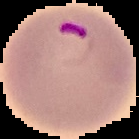

# Malaria-Image-Classification
For more detailed instructions please visit 

## Visualize Dataset
Dataset can be downloaded from [Malarial Cell Images Dataset](https://www.kaggle.com/iarunava/cell-images-for-detecting-malaria)

Some examples of the dataset are shown below.
|Image class|Image 1|Image 2|Image 3|Image 4|Image 5|
|-----------|-------|-------|-------|-------|-------|
**Parasite Image**|||||
**Non Infected Image**|||||
  